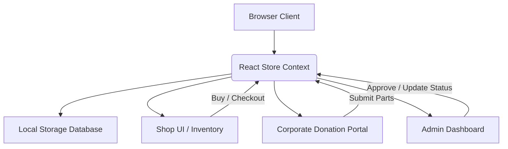

# PC Recycle Website - Design Document

This document outlines the design, architecture, and user experience specifications for the PC Recycling website.

---

## 1. Project Overview

The **PC Recycle Website** is a modern, static, web-based platform tailored for individual and corporate recycling of computer parts. 
- **Purpose**: Facilitate the recycling and resale of PC components, directing profits to charities.
- **Target Audience**: The owner (personal tracking), corporate donors, and general buyers of recycled parts.
- **Key Constraints**: 
  - Hostable on **GitHub Pages** (fully static, zero-server architecture).
  - No user authentication required (designed for personal use and trust-based local workflow).
  - Light/Dark theme supporting modern web design standards.

---

## 2. Tech Stack

- **Framework**: [Next.js](https://nextjs.org/) (Static Export mode)
- **Language**: TypeScript
- **Styling**: [Tailwind CSS](https://tailwindcss.com/)
- **UI Components**: [shadcn/ui](https://ui.shadcn.com/) (built on Radix UI primitives and Lucide Icons)
- **Database / State**: React Context API synchronized with `localStorage`
- **Deployment**: GitHub Actions deploying to GitHub Pages (`gh-pages` branch)

---

## 3. Architecture & Data Flow

Since this site is hosted on GitHub Pages, it has no traditional backend database. Instead, it operates using a local client-side data architecture:



### Mock Database Schema (`localStorage`)

We store all data in a single JSON state key (e.g., `pcrecycle_state`) containing:

#### 1. `inventory` Table (PC Parts)
```typescript
interface PCPart {
  id: string;
  name: string;
  category: 'CPU' | 'GPU' | 'RAM' | 'Motherboard' | 'Storage' | 'PSU' | 'Case' | 'Other';
  specs: Record<string, string>; // e.g. { socket: "AM4", speed: "3200MHz" }
  condition: 'New' | 'Like New' | 'Good' | 'Fair' | 'Scrap';
  price: number; // Listed sale price
  donorName: string; // Corporate or individual donor name
  charityId: string; // Charity receiving proceeds
  status: 'available' | 'sold' | 'scrap';
  imageUrl: string;
}
```

#### 2. `donations` Table (Incoming leads from Corporate Partners)
```typescript
interface Donation {
  id: string;
  companyName: string;
  contactEmail: string;
  partsDescription: string;
  quantity: number;
  conditionEstimate: string;
  status: 'pending' | 'received' | 'listed' | 'rejected';
  submittedAt: string;
}
```

#### 3. `orders` Table (Checkout records)
```typescript
interface Order {
  id: string;
  customerName: string;
  customerEmail: string;
  shippingAddress: string;
  items: PCPart[];
  totalPrice: number;
  paymentStatus: 'paid' | 'pending';
  orderDate: string;
}
```

#### 4. `charity` Table
```typescript
interface Charity {
  id: string;
  name: string;
  description: string;
  totalFundsRaised: number;
}
```

---

## 4. Visual Design System

The visual design is crafted to look premium, modern, and aligned with ecological recycling themes:

- **Typography**: 
  - Headings: `Outfit` (sleek, high-tech geometric sans-serif)
  - Body: `Inter` (neutral, readable, professional)
- **Color Palette (Dark Mode - Primary Focus)**:
  - Background: Slate-950 (`#020617`) and Slate-900 (`#0f172a`)
  - Accent/Primary: Emerald-500 (`#10b981`) and Emerald-400 (`#34d399`) (Symbolizes environmental recycling and money raised)
  - Neutral text: Slate-100 (`#f1f5f9`) and Slate-400 (`#94a3b8`)
  - Borders/Cards: Semi-transparent Slate-800 with glassmorphism effects (`backdrop-blur-md bg-slate-900/50 border-slate-800/80`)
- **Animations**:
  - Hover zoom transitions (`transition-all duration-300 hover:scale-[1.02]`)
  - Smooth card glow overlays using Tailwind shadow effects.

---

## 5. Page Designs & UI Workflows

### 5.1 Navigation Bar & Footer
- **Nav**: Glowing logo, Search input, Link to Shop, Corporate Donation, Admin Dashboard, and a Cart indicator with item count.
- **Footer**: standard links (Terms, Privacy, Contact), social handles, and dynamic e-waste stats tracker.

### 5.2 Home Page
- **Hero**: Giant title "Recycle, Rebuild, Restore" with a subtext explaining how corporate IT waste becomes charitable funding. Buttons: `Donate Parts` (Anchor to Corp Portal), `Browse Parts` (Anchor to Shop).
- **Impact Counter**: Real-time counter of total PC parts saved, landfill weight avoided (lbs), and donation dollars generated.
- **Categories Scroll**: Fast navigation badges.
- **Shop Grid**: Cards displaying each available part (Specs, Image, Condition, Price, Target Charity, and "Add to Cart").

### 5.3 Corporate Dashboard & Donation Portal
- **Donation Submission Form**: Sleek step-by-step form to declare donor name, contact info, estimated component list, and logistics needs.
- **Impact Section**: Custom cards showing the corporate donor's specific statistics:
  - Total items donated.
  - Estimated e-waste landfill weight saved (lbs).
  - Total dollars raised for charity from their parts.
- **Donation History**: Table with status tracker (Pending approval -> Scheduled for pickup -> Received -> Listed in Shop).

### 5.4 Admin Dashboard (Control Center)
- **Inbox**: Review pending corporate donations with "Accept" and "Reject" buttons.
- **Inventory Intake Form**: When a donation is accepted, this form converts it into individual shop items (assign category, specs, condition, list price, and destination charity).
- **Financial Board**: Chart showing charity allocations and total sales.
- **Orders View**: View orders placed by clients.

### 5.5 Checkout & Purchase Workflow
- **Cart Side-Drawer**: Quick view of items in cart.
- **Checkout Form**: Simulates entering billing, shipping, and credit card information. Clicking "Place Order" completes the transaction, updates items to `sold`, adds transaction log, and clears the cart.

---

## 6. GitHub Pages Deployment Strategy

To automate builds and keep the repository synchronized, we will implement a GitHub Actions deployment workflow.

1. The developer pushes code to the `main` branch.
2. The GitHub Action runs:
   - Sets up Node.js.
   - Restores npm cache.
   - Installs dependencies (`npm ci`).
   - Compiles Tailwind CSS and exports static files (`npm run build`, which triggers `next build`).
   - Deploys the generated output folder (`out`) to the `gh-pages` branch using `JamesIves/github-pages-deploy-action`.
3. GitHub Pages serves the static output directory on `https://<username>.github.io/<repository-name>/`.
